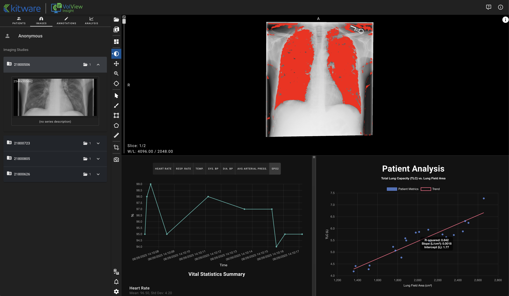

# VolView Insight




---

## 📖 About

**VolView Insight** is an open-source platform that unifies **medical imaging** and **clinical data** into one extensible interface.  
It provides researchers with a realistic testbed for **developing, testing, and extending multimodal models** in settings that mirror clinical reality.  

**Highlights**
- 🔬 Unified access to imaging data (DICOM/DICOMWeb) and clinical records (FHIR/EHR).  
- 🧠 Extensible backend for AI/ML pipelines, including deep learning inference.  
- ⚡ Web-based UI built on [VolView](https://github.com/KitwareMedical/VolView).  
- 🔌 Pluggable integrations — Orthanc, HAPI on FHIR, and MedGemma are examples. Users can bring their **own DICOM/FHIR servers or multimodal pipelines**.

---

## 🚀 Quick Start

### 0) Prerequisites

Install the following:
- **Node.js** (use `nvm` to manage versions)
- **Python** ≥ `3.10` (tested with 3.10)
- **Poetry** `2.1.2`
- **Docker** `28.0.04`
- A **DICOMWeb** server (e.g., Orthanc)
- A **FHIR** server (e.g., HAPI on FHIR)

---

### 1) Clone the repository

```bash
git clone https://github.com/KitwareMedical/volview-insight.git
cd volview-insight
git submodule update --init
```

---

### 2) Apply VolView patches

```bash
# All platforms
cat ./core-volview-patches/VOLVIEW_BACKEND.patch | git -C core/VolView apply

# macOS only
cat ./core-volview-patches/MACOS_COMPATIBILITY.patch | git -C core/VolView apply
```

---

### 3) Setup a DICOM server (Orthanc example)

You can use **any** DICOMWeb server. Below are example setups for Orthanc.

#### Option A — Docker

```bash
# Run Orthanc with DICOMWeb plugin and NO authentication (dev only)
docker run --rm -p 8042:8042 -p 4242:4242 \
  -e ORTHANC__AUTHENTICATION_ENABLED=false \
  -e DICOM_WEB_PLUGIN_ENABLED=true \
  orthancteam/orthanc
```

Verify at: [http://localhost:8042/](http://localhost:8042/)

#### Option B — macOS (native binary)

1. Download Orthanc: <https://www.orthanc-server.com/static.php?page=download-mac>  
2. Run `startOrthanc.command`  
3. Verify at: `http://localhost:8042/`

---

### 4) Setup a FHIR server (HAPI on FHIR example)

You can use **any** FHIR R4 server. Example with SMART on FHIR HAPI image:

```bash
docker pull smartonfhir/hapi-5:r4-empty
docker run -dp 3000:8080 smartonfhir/hapi-5:r4-empty
```

Verify at: [http://localhost:3000/hapi-fhir-jpaserver/fhir/Patient](http://localhost:3000/hapi-fhir-jpaserver/fhir/Patient)

---

### 5) Setup the Python backend (AI pipelines)

The Python backend executes multimodal pipelines. You can extend it with your own.

```bash
cd volview-insight/server
poetry env use /path/to/bin/python3.10
poetry install
poetry run python -m volview_server -P 4014 -H 0.0.0.0 volview_insight_methods.py
```

> If you encounter issues, remove `-P 4014`.

#### Example integrations
- **MedGemma**: Hugging Face gated models (requires account + access token).  
- **Segmentation**: Example lung segmentation model:

```bash
curl https://data.kitware.com/api/v1/file/65bd8c2f03c3115909f73dd7/download --output segmentLungsModel-v1.0.ckpt
```

---

### 6) Start the VolView Insight web app

```bash
nvm use 18.17.1
npm install --force
npm run setup-project
npm run build
npm run preview
```

Now open: **http://localhost:4173/**

---

### 7) (Optional) Orthanc proxy (for CORS testing only)

```bash
cd volview-insight/orthanc-proxy
nvm use 23.10.0
npm install
npm run dev
```

> ⚠️ Must use **Node.js 23.10.0** for the proxy. Runs at port `5173`.

---

## 📊 Example data

VolView Insight requires images **with patient records**. IDs in DICOM must match those in FHIR.

Example: [`notebooks/02-load-pt-matched-data-into-volview-insight.ipynb`](./notebooks/02-load-pt-matched-data-into-volview-insight.ipynb)

---

## 🧩 Extending VolView Insight

- **DICOMWeb**: Replace Orthanc with your own server.  
- **FHIR/EHR**: Replace HAPI with your own server.  
- **Pipelines**: Extend the Python backend with your custom multimodal methods.  

---

## 🧑‍💻 Contributing

We welcome contributions!

- Improve docs & tutorials  
- Add new pipelines or models  
- Add integrations with other EHR/DICOM backends  
- Report bugs and propose features

See [`CONTRIBUTING.md`](./CONTRIBUTING.md).

---

## 📜 License

[Apache 2.0](./LICENSE) © Kitware
